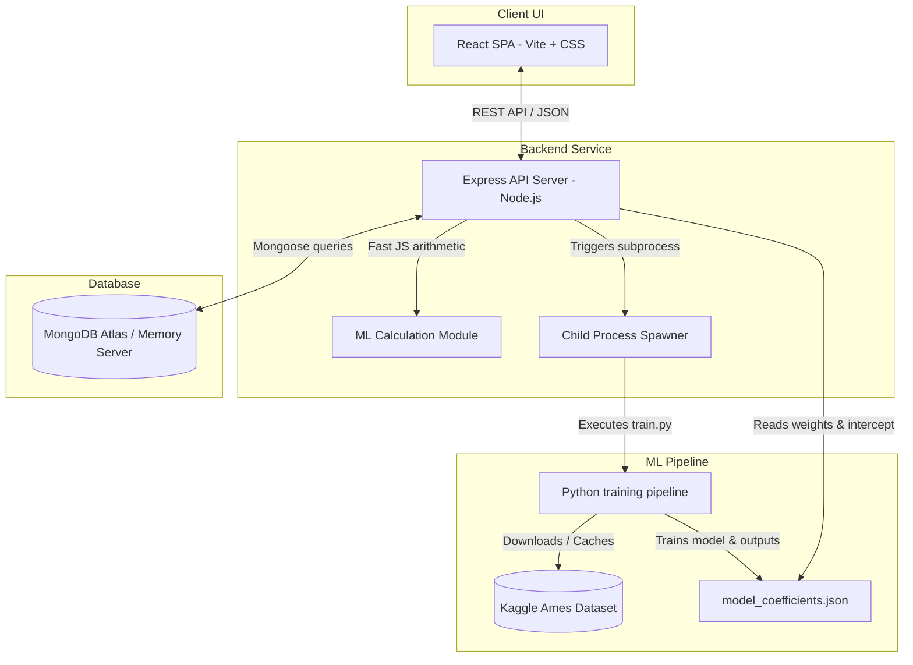

# 🏠 EstiNest — Machine Learning House Price Prediction Engine

[](https://react.dev)
[](https://react.dev)
[](https://nodejs.org)
[](https://www.mongodb.com)
[](https://scikit-learn.org)
[](https://opensource.org/licenses/MIT)

**EstiNest** is a production-grade, full-stack machine learning web application. It trains an **Ordinary Least Squares (OLS) Linear Regression** model on historic transaction records from the Kaggle Ames Housing dataset to predict residential property valuations. The app features a high-fidelity React dashboard in a custom "Forest Mist" color palette, an on-demand model retraining pipeline, multicurrency conversion, and persistent prediction logs.

---

## 🛠️ System Architecture

EstiNest combines a Node.js Express server, a React frontend SPA, a MongoDB database, and a Python regression training subprocess.



---

## 🔬 Mathematical Regression Model

The mathematical estimation engine uses multi-variable Ordinary Least Squares (OLS) regression trained on **1,460 transaction samples** from Ames, Iowa.

### Prediction Formula
The predicted valuation is calculated dynamically:

$$\text{Valuation} = \beta_0 + \beta_1(\text{SqFt}) + \beta_2(\text{Bedrooms}) + \beta_3(\text{Bathrooms})$$

Where:
*   $\beta_0$ (Intercept) = **\$52,261.75**
*   $\beta_1$ (Square Footage Coefficient) = **+\$104.03** per sq ft (represents the living area impact)
*   $\beta_2$ (Bedrooms Coefficient) = **-\$26,655.17** per bedroom (penalizes room subdivision for a fixed square footage)
*   $\beta_3$ (Bathrooms Coefficient) = **+\$30,014.32** per bathroom (corresponds to bathroom utility addition)

---

## 🌟 Key Features

*   **Interactive Prediction Sandbox**: Real-time evaluation of housing valuations using range sliders or numerical inputs, featuring visual confidence ranges based on the model's Root Mean Squared Error (RMSE).
*   **On-Demand Model Retraining**: Trigger python retraining with one click via a Node child subprocess, downloading the latest dataset, rebuilding model weights, and updating metrics.
*   **Multicurrency Conversion**: Real-time currency conversions (INR default, USD, EUR, GBP, JPY, AUD, CAD) with editable currency exchange rate buffers and localized pricing.
*   **Model Insights Dashboard**: Clear statistical analytics detailing active model coefficients ($R^2$ Score, RMSE, MAE, feature weight impacts) and active training metadata.
*   **Persistent Prediction Logs**: CRUD operations linked to a MongoDB database, allowing users to save estimates, write custom comments, rate valuation accuracy, and delete entries.
*   **Zero-Config Failback Database**: Automatically pulls and runs a local in-memory MongoDB server (`mongodb-memory-server`) if no external connection string is provided.

---

## 💻 Technology Stack

| Component | Technology | Description |
| :--- | :--- | :--- |
| **Frontend** | **React 18 (Vite)** | Responsive dashboard UI |
| **Styling** | **Vanilla CSS** | Modern glassmorphism system in "Forest Mist" color palette |
| **Backend** | **Node.js + Express** | High-performance REST API Server |
| **Database** | **MongoDB / Mongoose** | Persistent history logs and model version tracking |
| **ML Engine** | **Python + Scikit-Learn** | Subprocess-driven dataset downloads and OLS regression |
| **Glow & Icons** | **Lucide React** | High-contrast visual symbols |

---

## 📂 Repository Layout

```
Task-1/
├── package.json               # Monorepo workspace configurations
├── README.md                  # Main developer documentation
├── backend/
│   ├── package.json           # Express server dependencies
│   ├── server.js              # Express application core entry point
│   ├── config/
│   │   └── db.js              # MongoDB connector with local fallback
│   ├── models/
│   │   ├── Prediction.js      # Mongoose schema for prediction logs
│   │   └── ModelVersion.js    # Mongoose schema for model training history
│   ├── routes/
│   │   ├── model.js           # API routes for training & coefficients
│   │   └── predictions.js     # API routes for calculation & CRUD logs
│   └── ml/
│       ├── train.py           # Python ML training pipeline
│       └── model_assets/
│           └── model_coefficients.json  # Trained JSON regression parameters
└── frontend/
    ├── package.json           # React dependencies
    ├── index.html             # Vite html entry point
    └── src/
        ├── main.jsx           # Mounting file
        ├── App.jsx            # EstiNest main layout & control view
        └── index.css          # Design system stylesheet
```

---

## 🚀 Installation & Setup

### Prerequisites
*   **Node.js** (v18+)
*   **npm** (v9+)
*   **Python** (v3.8+) with libraries (`pandas`, `numpy`, `scikit-learn`)

### 1. Clone Repository & Install Dependencies
From your terminal, run the workspace bootstrap script to install all monorepo dependencies across the root, backend, and frontend directories:
```bash
npm run install-all
```

### 2. Configure Environment (Optional)
Create a `.env` file inside the `backend/` directory to configure custom ports or point to a cloud MongoDB Atlas cluster:
```env
PORT=5000
MONGODB_URI=mongodb+srv://<user>:<password>@cluster.xxxx.mongodb.net/estinest
NODE_ENV=development
```
*If no `MONGODB_URI` is supplied, the backend will automatically initialize an in-memory database fallback for easy developer testing.*

---

## 🏃 Running the Application

To start the Node Express API backend and Vite React frontend concurrently in development mode, run from the root directory:
```bash
npm run dev
```

The services will initialize at:
*   **Vite React Frontend**: `http://localhost:5173`
*   **Express API Server**: `http://localhost:5000`

---

## 📡 API Documentation

### Model Endpoints (`/api/model`)
*   `GET /api/model/info`: Retrieves current coefficients, intercept, and training performance metrics (R2, RMSE).
*   `POST /api/model/retrain`: Executes the Python subprocess to download, clean, and retrain on the Ames housing dataset.

### Predictions Endpoints (`/api/predictions`)
*   `POST /api/predictions`: Computes prediction value, logs to MongoDB, and returns valuation.
    *   *Body*: `{ "squareFootage": 1500, "bedrooms": 3, "bathrooms": 2 }`
*   `GET /api/predictions`: Retrieves all persistent prediction logs.
*   `POST /api/predictions/:id/feedback`: Adds textual comments and star ratings to a log entry.
    *   *Body*: `{ "rating": 5, "comment": "Excellent valuation matching market expectations" }`
*   `DELETE /api/predictions/:id`: Deletes a log entry.

---

## 🛡️ License

Distributed under the MIT License. See [LICENSE](LICENSE) for more details.
